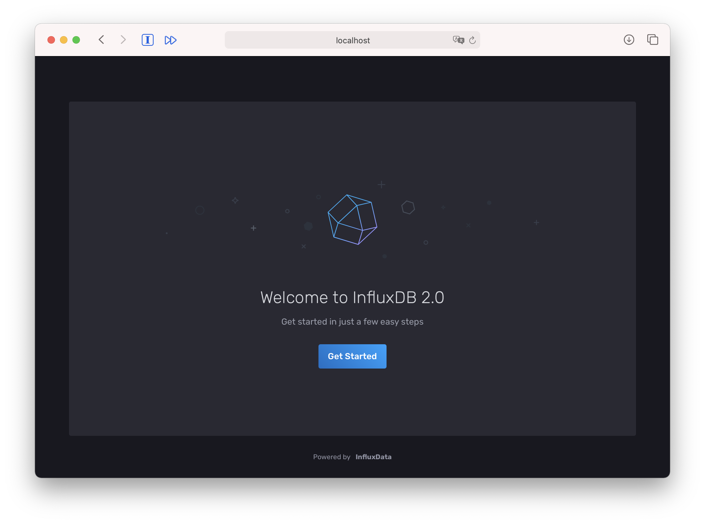
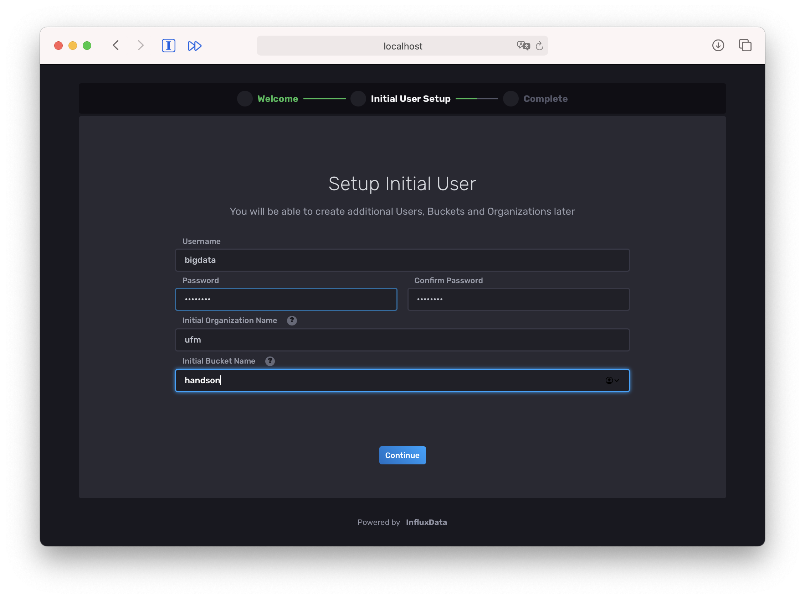
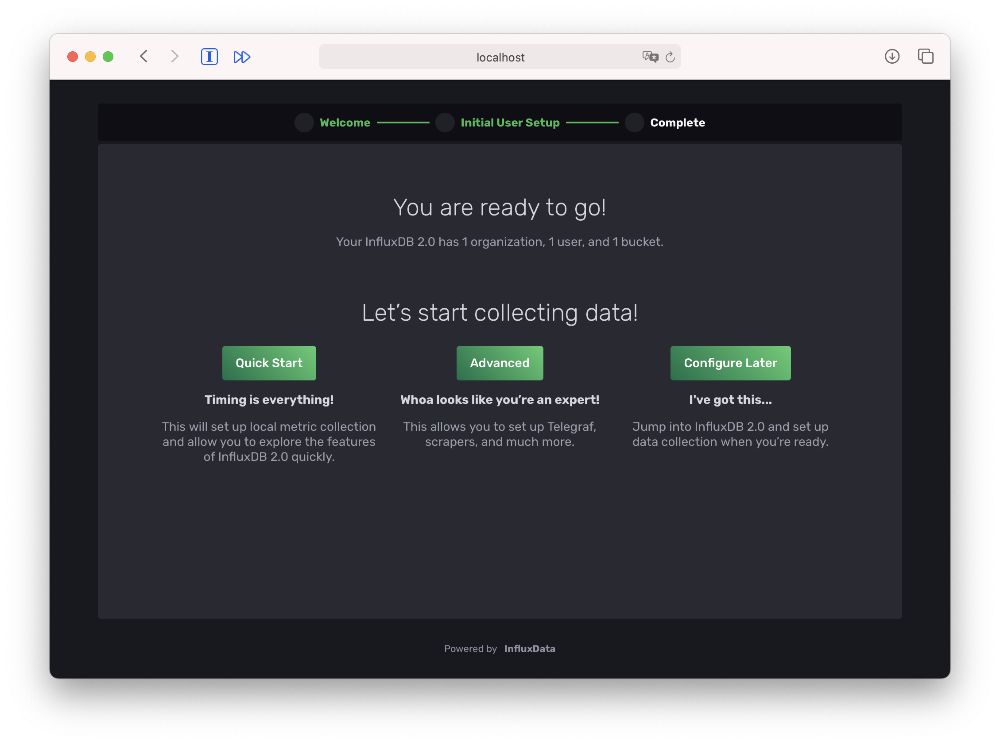
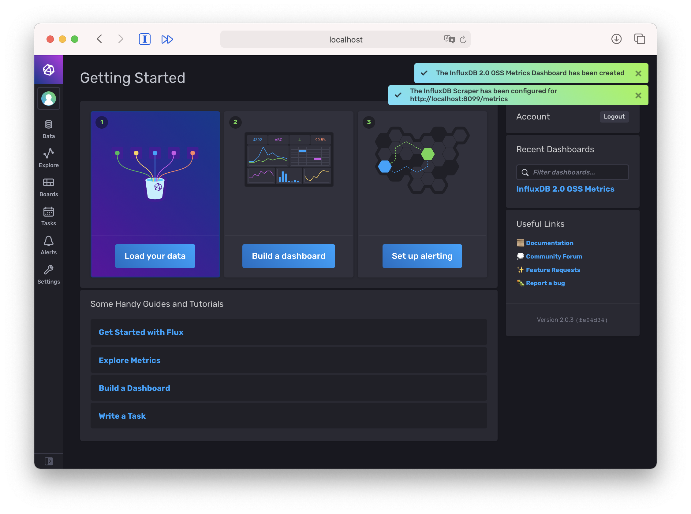
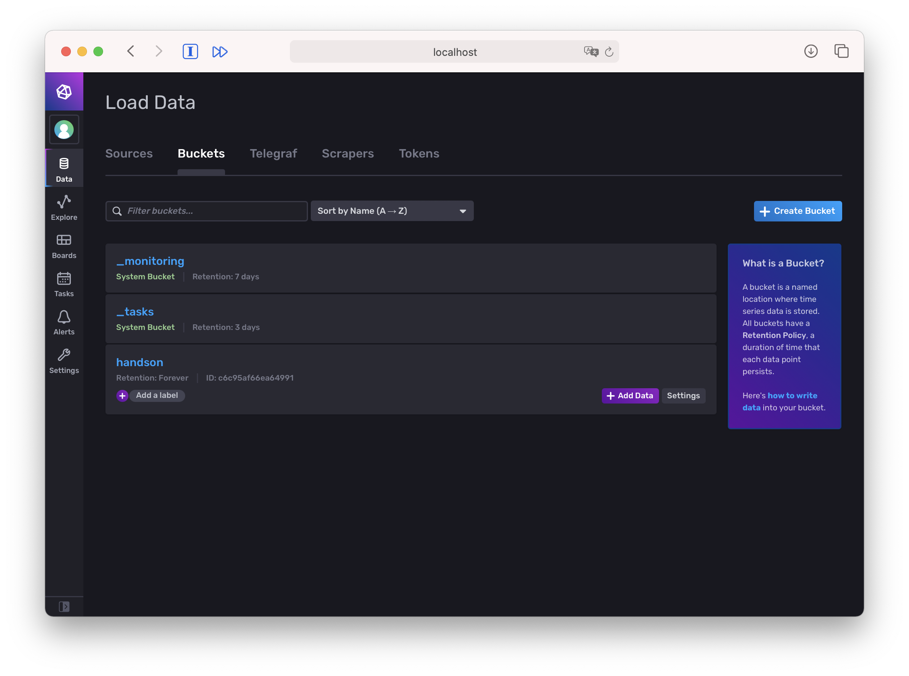
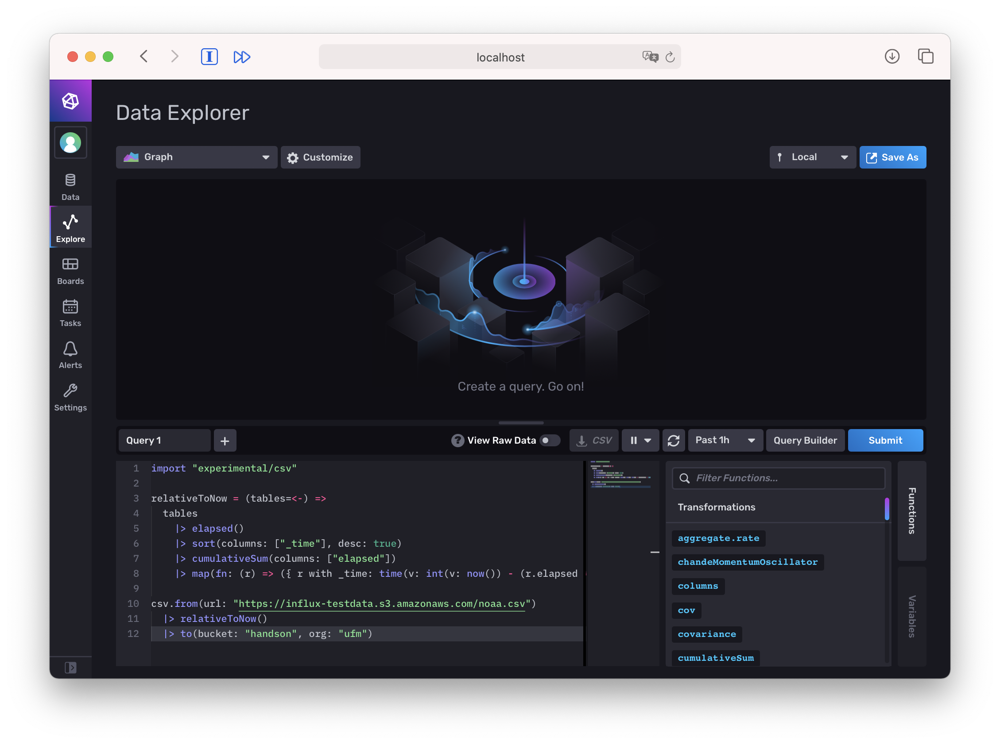
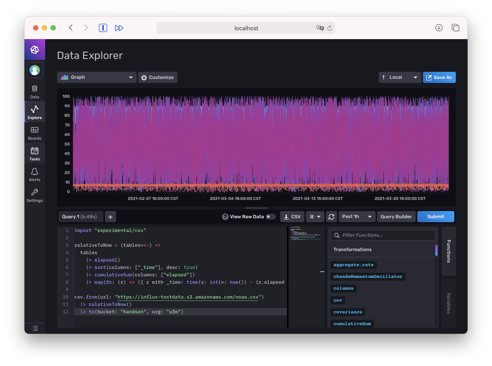
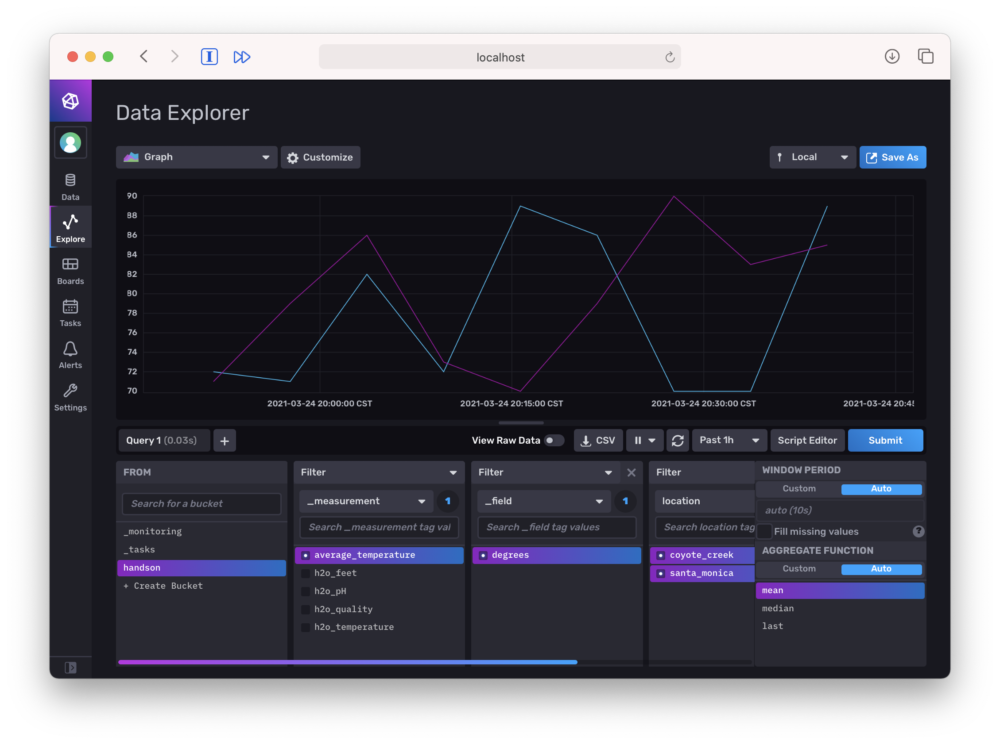

# HandsOnBigData TSDB
------------------


Como parte del ejercicio, vamos a:
1. Configurar rápidamente el InfluxDB2.0 en nuestra máquina local
2. Llenar algunos datos de muestra
3. Consultar con Flux

## Pasos: 

### 1. Crear un servicio utilizando docker-compose 🚀

1.1 Creamos el archivo docker-compose.yml


```yaml
version: "2.1"

services:

  influxdb:
    hostname: influxdb
    image: quay.io/influxdb/influxdb:v2.0.3
    container_name: influxdb
    ports:
        - 8099:8086
```

1.2 Luego corremos el docker-compose


```bash
docker-compose up
```

1.3 Chequeamos que el servicio esté funcionando bien
Para eso abrimos el siguiente url: [http://localhost:8099](http://localhost:8099)

Debería aparecer lo siguiente:



1.4 Hacemos click en "Get Started"

### 2. Ingresamos la configuración del usuario ⚙️

2.1 Luego ingresamos los datos correspondientes:


``` Organization Name: ufm
Bucket Name: handson ```



2.2 Después de dar click en "Continue", se nos pedirá que completemos la configuración.

2.3 Seleccionar la opción "Quick Start" para realizar la configuración rápida y omitir complejidades.



2.4 Cuando la configuración este lista, nos mostrará la siguiente página de control:



#### 3. Comprobar los Buckets disponibles 📋


```Un bucket es una ubicación con nombre donde se almacenan los datos de las series temporales. Todos los buckets tienen una política de retención, una duración de tiempo que cada punto de datos persiste. Un bucket pertenece a una organización.
```

Para verificar rápidamente el bucket que hemos creado anteriormente, podemos navegar a:
``` Data 
> Buckets
```


#### 4. Cargar data en el bucket 📄

Para cargar una muestra de datos en influxDB, podemos entrar en el bucket haciendo click en "Bucket Name". En la siguiente pantalla, podemos ver un montón de opciones.

Cargaremos los datos utilizando el comando flux. Para ejecutar los comandos flux, haga clic en "Script Editor" como se muestra a continuación:



Cuando el editor este abierto, correremos el siguiente comando:

```import "experimental/csv"

relativeToNow = (tables=<-) =>
  tables
    |> elapsed()
    |> sort(columns: ["_time"], desc: true)
    |> cumulativeSum(columns: ["elapsed"])
    |> map(fn: (r) => ({ r with _time: time(v: int(v: now()) - (r.elapsed * 1000000000))}))

csv.from(url: "https://influx-testdata.s3.amazonaws.com/noaa.csv")
  |> relativeToNow()
  |> to(bucket: "handson", org: "ufm")
```

Si los datos fueron cargados con éxito veremos inmediatamente un gráfico:




Tome en cuenta que el bucket name y la organización son las que pusimos antes.

Ahora si volvemos al "Query Builder" y refrescamos la página, veremos todos los campos sobre los que se puede aplicar el filtrado.



Eso es todo 😊


